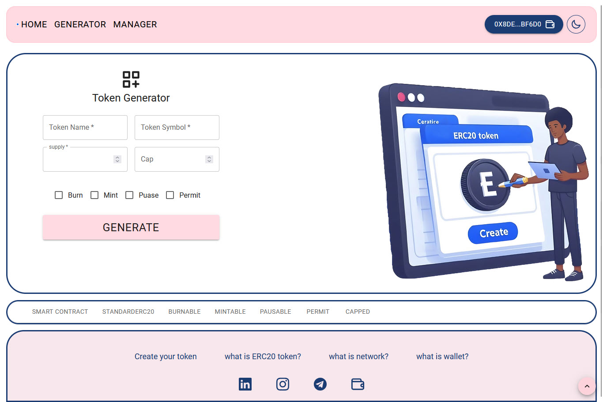
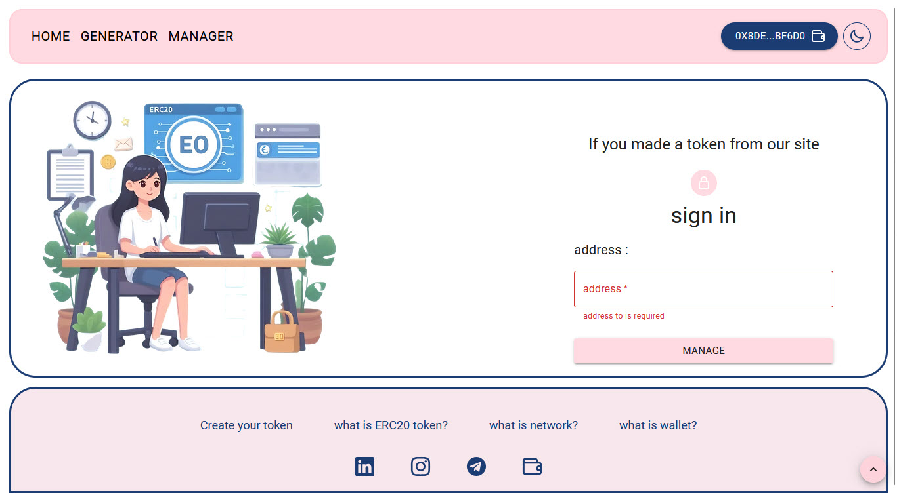
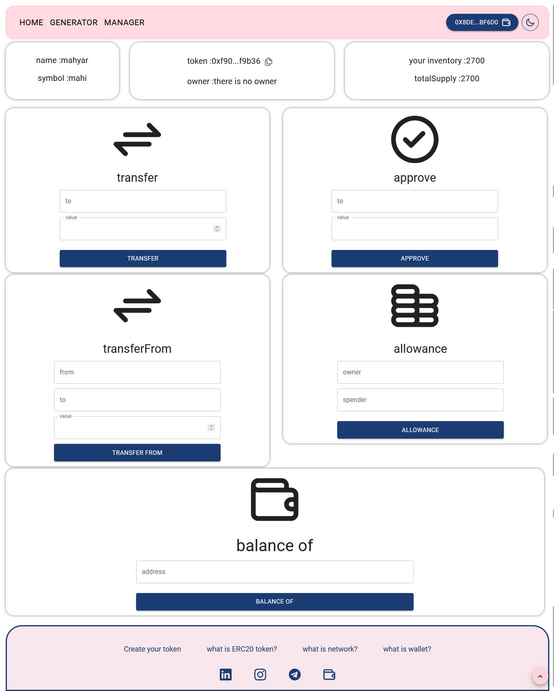

# Token Generator


An ERC-20 token is a digital asset on the Ethereum blockchain.\ It's a standard type of Ethereum token that can be traded and used in applications.\ They're like "smart" digital coins that can have extra features.\ With this Dapp, you can manage your ERC20 token.
In this project, you can create your own token without typing a code and just by clicking a few clicks.\
you can track token you made with this Dapp.\
you can manage your tokens in this project.

## Home page image


## Generator page image



## Manager Login page image



## Manager page image



## Clone Repository

```sh
git clone https://github.com/mahdiZarrei/Token-generator.git
cd Token-generator
```

## Requirements

[node.js](https://nodejs.org/en/) v10.18.0+ And [Metamask](https://metamask.io/) extension on your browser

## Installation

Use the package manager [npm](https://www.npmjs.com/) to install token generator.

```bash
npm install
```

## Usage

```bash
npm run dev
```

Open `localhost:5173` to access the application!

## License

MIT
